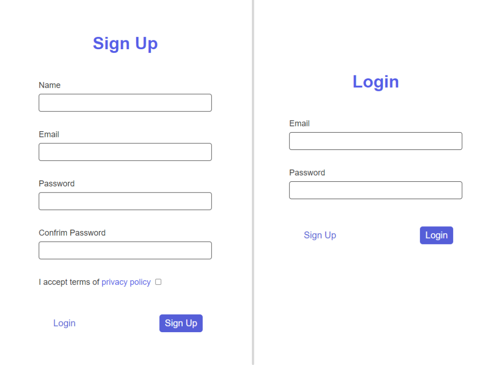

# React Form Signup Login using React

Handling User a <strong><i>Simple</i></strong> Registration and Login with React, Form validations using Pure ReactJS applications without any external package and API.

Simple and optimized React Form Signup Login [( See Demo )](https://diwa-signup-form.netlify.app/) . It includes: 

- [x] React 16.5.8
- [x] ECMAScript 6+ and JSX support
- [x] Latest Webpack (v.4.16.5), Babel 7 and Webpack Dev Server (v.4.19.1) with Scope Hoisting enabled
- [x] ES6 linting with continuous linting on file change
- [x] Separate CSS stylesheets generation
- [x] Automatic HTML generation

## Starting the dev server

Make sure you have the latest Stable or LTS version of Node.js installed.

1. `git clone https://github.com/am-abazari/React-Form-Signup-Login`
2. Run `npm install` or `yarn install`
3. Start the dev server using `npm start`
4. Open [http://localhost:3000/](http://localhost:3000/)

Open [jsonplaceholder.typicode.com/users](https://jsonplaceholder.typicode.com/users) for list of users

 
 
For Login Test :

1. Username : API ` username `
2. Password : API ` address.zipcode `

Example : 

- Username : ` Bret `
- Password : ` 92998-3874 `
 
 

## Available Commands

- `npm start` - start the dev server
- `npm clean` - delete the dist folder
- `npm run build` - create a optimized build in `build` folder

## Code Coverage

The project is using the <strong>JsonPlaceholder API</strong>. All configurations are located in `package.json`, inside the `jest` object.

The coverage report consists of an HTML reporter, which can be viewed in the browser and some helper coverage files like the coverage json file.

## About Author

<strong>Amirhossein Abazari</strong> Full-Stack Web Developer
